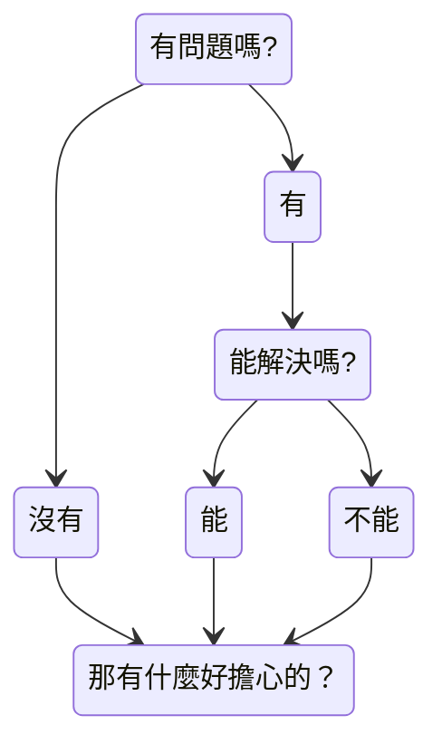

```mermaid
stateDiagram
    trouble: 有問題嗎?
    resolve: 能解決嗎?
    noWorry: 那有什麼好擔心的？
    trouble --> 有
    trouble --> 沒有
    有 --> resolve

    resolve --> 能
    resolve --> 不能
    沒有 --> noWorry
    能 --> noWorry
    不能 --> noWorry
```
